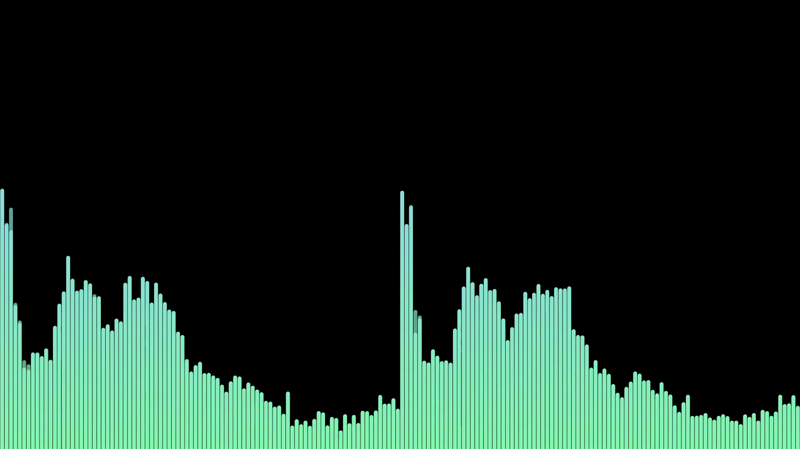
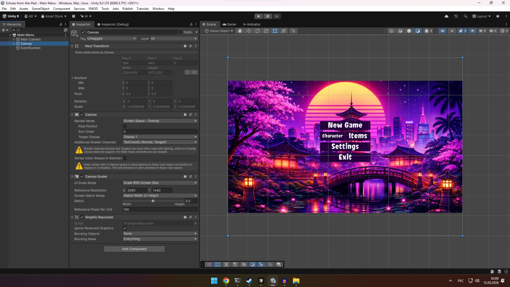
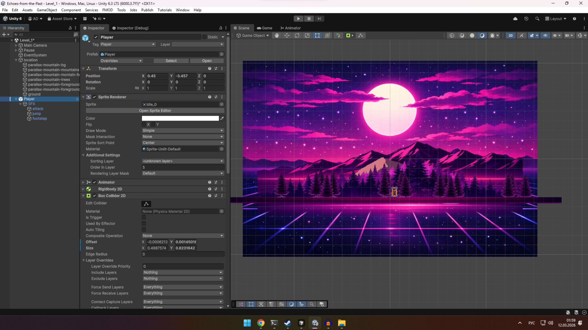
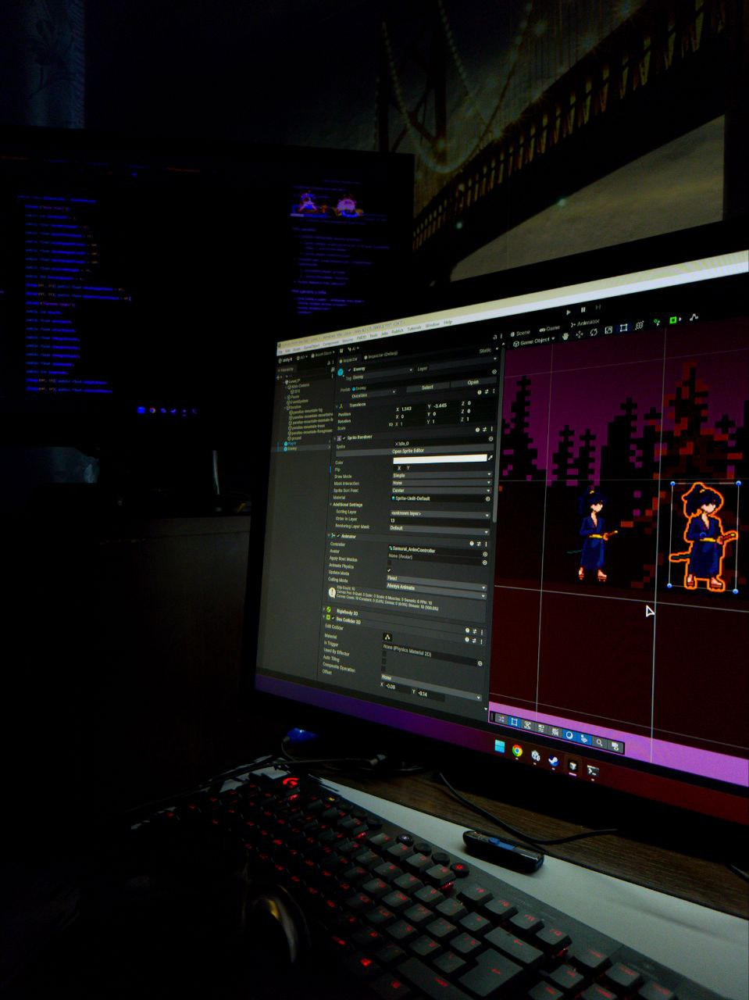

 # Arthur (StGrikus)

I’m a technical sound designer, developer, and musician. My path is a non-traditional, but very natural mix: I came into game dev and programming from engineering (aircraft engines). That background taught me to take complex systems apart into parts and rebuild them so everything works perfectly—whether it’s sound physics or code architecture.

I’m also a barista, so good code and dense sound design always happen with the perfect pour-over in the background.

### Tech & sound stack
- Programming languages: C#, Java
- Sound design & music: guitar, keyboards, analog synthesizers, FMOD, FL Studio, stem mastering
- Focus: DSP, spectral analysis, procedural sound generation, and live sound recording

Always open to interesting discussions at the intersection of code and sound, indie games, and recipes for great coffee.

I’m also open to collaboration and partnership offers—feel free to reach out.

## True Audio Spectrum Analyzer

Unlike many “visualizers” that only fake a reaction to sound, this project is a **real spectrum analyzer**. It captures system audio via **WASAPI loopback** and runs an **FFT** on the signal in real time, showing levels per frequency band.

Project repo: https://github.com/StGrikus/Audio-Spectrum-Test-Build

### About the app (short)

This analyzer is built to make spectrum feel “physical”: it transforms the incoming audio into frequency-domain energy and renders a stable dB scale with responsive smoothing.

### Highlights

- **Real FFT math:** band levels are computed from analysis (not decorative animation).
- **Native capture:** listens to what plays on the selected **output** device using **WASAPI loopback**.

### Audio visualizer running:

### Other projects

#### Echoes-from-the-Past
**Genre:** Side-scroller roguelike  
**Setting:** Ancient Japan with a Synthwave aesthetic.  
**Signature challenge:** all sound design and music are synthesized exclusively with **ACID V**, to keep the game aggressive and recognizable—acid, but with a “dream logic” atmosphere.

Screenshots from development:

#### Collapse-machine
**Role:** Technical Sound Designer  
My main “engineer-to-audio” project and a starting point for technical sound design. It’s a serious team development that enabled deeper integration of audio middleware into game logic and inspired me to build my own tools and experiments.

YouTube: https://www.youtube.com/@stgrikus

### Build from source (Windows)

1. Clone this repository:
   - `git clone https://github.com/StGrikus/Audio-Spectrum-Test-Build.git`
2. Open the solution:
   - `System/AudioSpectrumWpf/AudioSpectrumWpf.sln`
3. Install:
   - .NET 8 SDK, and optionally Visual Studio 2022 / Rider with WPF support
4. Build:
   - `Release`, `x64`, then run `AudioSpectrumWpf`

**Requirements:** Windows 10/11 x64

### Portable / test build

Self-contained single-folder output from the repo root.

**CMD**
- Run: `AudioSpectrum.cmd run`
- Watch rebuilds: `AudioSpectrum.cmd watch`
- Clean `bin`/`obj`: `AudioSpectrum.cmd clean`
- Help: `AudioSpectrum.cmd help`

**PowerShell**
- Run: `.\AudioSpectrum.ps1 -Run`
- If execution policy blocks scripts:
  - `powershell -ExecutionPolicy Bypass -File .\AudioSpectrum.ps1 -Run`

Output:
- `dist/AudioSpectrum-Portable/AudioSpectrumWpf.exe`

On the first run, `settings.json` is created next to the executable.

### License

This software is proprietary. All rights reserved.

### Links

- [Instagram — @stgrikus](https://www.instagram.com/stgrikus/)
- [YouTube — @stgrikus](https://www.youtube.com/@stgrikus)
- [Telegram — Rainheaded Man](https://t.me/rainheadedman)
